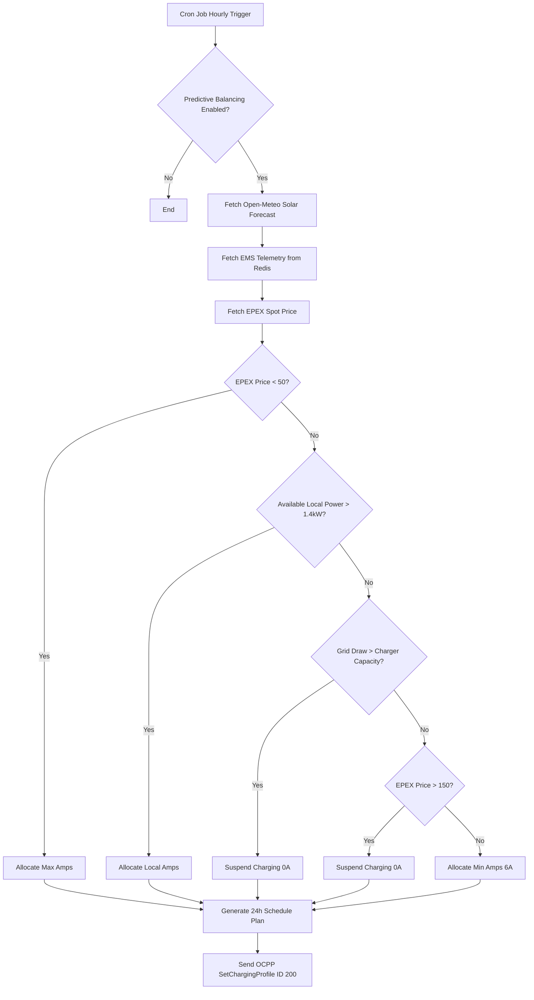

# Advanced EMS & Smart Charging Guide

Welcome to the Advanced EMS & Smart Charging Guide for the CPMS platform. This document bridges the gap between technical logic and user configuration, providing a deep technical analysis of the platform's intelligent energy routing, dynamic tariffs, predictive balancing, and Vehicle-to-Grid (V2G) capabilities.

## 1. Dynamic Tariffs & Spot Pricing

The platform integrates directly with Day-Ahead markets to offer dynamic, spot-priced charging sessions.

### Data Ingestion Strategy
The `EpexSpotService` coordinates the retrieval of Day-Ahead EPEX spot prices.
*   **Providers:** It fetches pricing primarily from EnergyZero (for NL/BE), ENTSO-E (if an API key is configured in the database under `ENTSOE_API_KEY`), and falls back to Energy-Charts if needed.
*   **Execution:** A background worker evaluates pricing data daily. If the current time is past the standard publication time (around 13:00 - 14:00 CET), it fetches pricing for the following day.
*   **Storage:** Prices are standardized and stored as `pricePerMwh` in the `epexSpotPrice` database table, enabling granular markup configurations by Charge Point Operators (CPOs).

## 2. Predictive Load Balancing

Predictive Balancing transforms reactive load management into proactive, cost-optimized energy dispatch. This is orchestrated by the `PredictiveBalancingService` and executed via the `predictiveBalancingCron.ts` hourly background job.

### Algorithmic Decision Making
For chargers with Predictive Balancing enabled, the system generates a rolling 24-hour charging plan. The algorithm factors in:
1.  **Weather/Solar Forecast:** Queries the Open-Meteo API for shortwave radiation to estimate local solar generation (`localSolarKwp`).
2.  **Live Telemetry:** Reads real-time site data (solar, battery, grid load) from Redis if an EMS Gateway is present.
3.  **Spot Prices:** Evaluates the EPEX Day-Ahead prices for the target hour.

> **Warning:** Improperly configuring the `localSolarKwp` or maximum amperage settings on the charger can result in severe phase imbalances or tripped breakers. Ensure site electrical limits are physically verified before enabling predictive dispatch.

### Load Balancing Decision Tree

## 3. V2G & Fleet Battery Management

### Dashboard Fleet Capacity & SoC Sliders
The CPMS dashboard features interactive widgets to monitor and manage fleet capacity. These **fleet capacity widgets** and **SoC (State of Charge) sliders** calculate available energy by dynamically querying the latest `MeterValue.soc` reported by the vehicle during the transaction. If real-time SoC is unavailable, the system safely falls back to `tx.finalMeterValue` to estimate fleet reserve capacity, ensuring accurate visualizations without relying on hardcoded values.

The `V2GOrchestrationService` manages bidirectional energy flows, turning EV fleets into active grid assets.

### Discharging Triggers
The service continuously evaluates EMS telemetry. If the current building grid draw indicates high load, it attempts to offset this by triggering V2G discharge.
*   **Capacity Checks:** The service queries the `VehicleEnergyProfile` associated with the active RFID user. It respects the `minSocThreshold` (e.g., 40%) to ensure vehicles retain enough charge for commuting. It also relies on the active `MeterValue.soc` or fallback to ensure accurate State of Charge.
*   **Discharge Dispatch:** When a discharge is triggered, the system calculates the required offset (capped by the charger's `power_capacity`) and sends an OCPP `SetChargingProfile` command.
*   **Discharge Profile:** A negative amperage limit is dispatched via Profile ID 300 to command the hardware to return energy to the grid.

> **Warning:** V2G Orchestration requires specialized bidirectional DC chargers (or emerging AC V2G standards) and specific vehicle support. Ensure hardware compatibility. Incorrectly pushing negative limit profiles to standard unidirectional chargers may cause hardware fault states.

## 4. EMS Gateway Integration

The CPMS seamlessly integrates with external energy hardware (Loxone, Eniris, Raspberry Pi) via the `EmsGatewayService`.

### Telemetry Sync
1.  **Authentication:** External gateways authenticate using a securely generated token (`auth_token`).
2.  **Data Processing:** Gateways push telemetry points (`solar_kw`, `battery_kw`, `grid_kw`, `house_kw`). Missing points default to zero.
3.  **Cache Layer:** To ensure ultra-fast reads for the orchestration services, data is written directly to a Redis hash (`ems_telemetry:${gateway_id}`). The key utilizes a 5-minute Time-To-Live (TTL) to guarantee that stale connection data is automatically evicted, preventing the system from acting on outdated load profiles.

## 5. General Load Management Service

For standard site and group load balancing, the `LoadManagementService` evaluates active load against theoretical capacities to prevent site overload.
*   **Site Load Profile:** Profile ID 100 is reserved for general Power Balancing/Site Load profiles.
*   **Amperage Profile:** Profile ID 101 is reserved for Amperage Load Management profiles.
*   **Safe Limit Enforcement:** If the theoretical maximum load drops back below 95% of the safe limit, the load management profiles are automatically cleared to resume maximum output.
