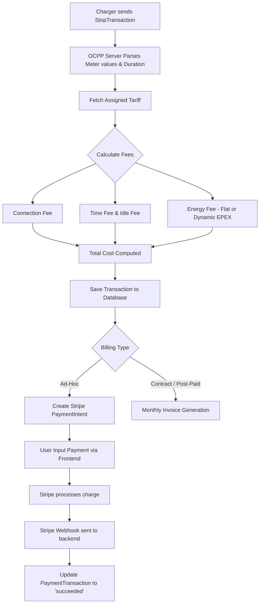

# Financial & Roaming Operations Manual

Welcome to the Financial & Roaming Operations Manual for the OCPP Central Processing Management System (CPMS). This guide is designed for business administrators and financial officers to navigate the core financial systems, roaming integrations, and settlement workflows.

## 1. Billing & Stripe Integration

The billing engine calculates the final cost of a charging session dynamically based on assigned tariffs and user profiles.

### End-to-End Billing Cycle

### Tariff Calculations
Tariffs are determined by looking up the `ChargeGroupUser` assignment, or falling back to the default `Charger` tariff. The final cost of a session is calculated exactly when the `StopTransaction` event is received from the EVSE.

The system computes:
- **Connection Fee:** A flat fee triggered per session start.
- **Time Fee:** Cost based on total connected minutes.
- **Idle Fee:** Cost based on minutes where the charger is plugged in but power draw is 0W.
- **Energy Fee:** Can be either a flat rate per kWh or dynamically calculated based on live EPEX spot market prices. For dynamic tariffs, exact consumption deltas between individual `meterValue` timestamps are multiplied by the spot market price of that exact interval.

### Stripe Integration (Ad-Hoc Payments)
Ad-hoc payments enable walk-in customers to pay directly via credit card without an account.
- The system generates a `PaymentIntent` containing the exact `amountInCents` upon completion of the charge.
- Users are presented with the Stripe `PaymentElement` in the frontend UI.
- The backend listens for the `payment_intent.succeeded` and `payment_intent.payment_failed` webhooks on `/api/payments/webhook`. It ensures raw body signature validation before marking the transaction as settled.

## 2. Reimbursements & Split-Billing

The reimbursement system is built for split-billing, designed primarily to reimburse employees for charging fleet vehicles at their personal home chargers.

### Workflow
1. **Contracts:** Administrators or users create a `ReimbursementContract` via the UI. This maps a `userId`, `rfidUserId` (fleet vehicle tag), `stationId` (employee home charger), an assigned `tariffId` (their home electricity rate), and their `IBAN`.
2. **Ledgers:** Each month, a `ReimbursementLedger` automatically aggregates the `totalKwh` consumed and the `totalAmount` due for that specific contract.
3. **SEPA Export:** Instead of manually transferring funds, finance officers can click **Export SEPA** in the UI. The backend generates a validated `pain.001.001.03` SEPA XML file containing all pending transfers, ready to be uploaded directly into your corporate banking portal.

## 3. Roaming (OCPI & OICP)

To maximize station utilization and allow your contracted drivers to charge anywhere, the system acts as both a Charge Point Operator (CPO) and a Mobility Service Provider (MSP) through the OCPI and OICP protocols.

### Configuring Connections
Connections to roaming hubs (e.g., Hubject, Gireve, or peer-to-peer CPOs) are configured in the Roaming UI tab.
- **OCPI Configuration:** Enter the Endpoint URL and the `Authorization: Token` credentials. OCPI is typically used for peer-to-peer roaming or direct hub integration.
- **OICP Configuration:** Enter the Endpoint URL and `Authorization: Bearer` credentials (standard for Hubject).

### CDR Pushes & Pulls
When a driver roams on your network (CPO mode), the CPMS captures the session and automatically generates a Charge Detail Record (CDR) which is pushed to the roaming partner.
When your driver uses an external network (MSP mode), the roaming partner pushes the CDR to your CPMS. The system reconciles this record against the roaming contract margin to display wholesale vs. retail costs.

## 4. Settlement & Ad-Manager

### Financial Settlements
The Settlement module generates monthly clearinghouse reports. These are essential for reconciling roaming revenue and costs.
- It aggregates all `RoamingSession` records.
- Calculates `totalWholesaleBilled`, `totalBaseCost`, and `netMargin` per partner.
- Heatmaps visualize stations attracting the most roaming sessions.
- Data can be exported as a raw CSV (`monthly_clearinghouse_report.csv`) for accounting software integration.

### Ad-Manager
For display-enabled chargers, the CPMS features an Ad-Manager to generate supplementary revenue.
- Advertisers or marketing teams can upload image (PNG, JPG) or video (MP4) assets.
- Drag-and-drop file uploads are supported in the Ad-Manager UI.
- Campaigns can be targeted specifically to individual stations, station groups, or entire geographic regions.
- The system handles the distribution of these media assets directly to compatible OCPP EVSE screens over the network.
