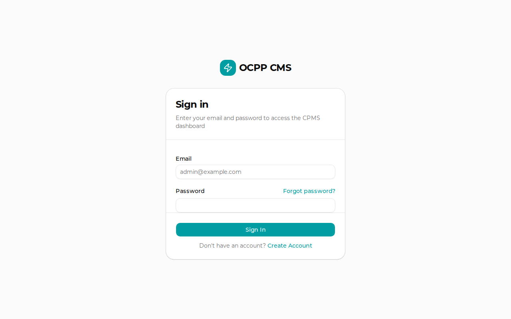

# The Charge Grid: Parking Ground Plan Manual

The Charge Grid is a premium feature module that allows Station Managers to create interactive 2D parking ground plans and monitor EV charging statuses in real-time.

## Enabling the Feature

1. Navigate to **Stations** in the admin dashboard.
2. Select a station and click **Edit**.
3. Scroll down to the **Enable Ground Plan** toggle and switch it ON.
4. Once enabled, an **Edit Ground Plan Layout** button will appear.

## Building the Ground Plan

Clicking the Edit button opens the Ground Plan Builder:

### Controls:
- **Add Spot**: Creates a new draggable parking spot on the canvas.
- **Drag & Drop**: Click and drag any spot to align it with your physical parking layout.
- **Rotate**: Click the small circular arrow icon on a spot to rotate it by 45 degrees.
- **Delete**: Click the trash can icon to remove a spot.
- **Name**: Click the text input inside the spot to rename it (e.g., "VIP 1", "Spot A").
- **Assign Connector**: Use the dropdown inside the spot to link an available physical charger socket to that parking space.

Once satisfied with the layout, click **Save Plan**.

## Live View Dashboard

To access the real-time monitoring view, navigate to the station's Live View page (accessible via the `Monitor Live` badge or `/stations/[id]/live`).

The Live View renders the parking layout with beautiful glassmorphism overlays that react to real-time OCPP telemetry.

### Visual States:

* **Available (Blue)**: The spot has an assigned socket that is online but currently unused.
* **Charging (Green Pulse)**: A vehicle is connected and actively drawing power. The overlay displays:
  * Live Power (kW)
  * Energy Consumed (kWh)
  * Active Session RFID / User ID
* **Unavailable (Red)**: The assigned charger is faulted or offline.
* **Unassigned (Dashed border)**: A parking spot exists but no charger socket has been assigned to it yet.
