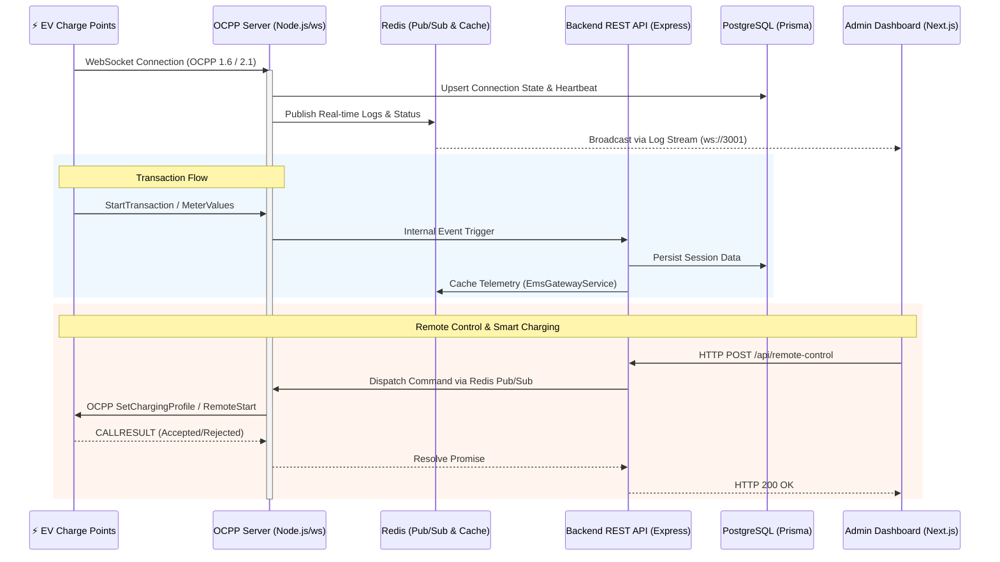

# Platform Overview & System Architecture

## 1. Executive Summary

The OCPP Central Processing Management System (CPMS) is an enterprise-grade platform designed to manage and monitor Electric Vehicle (EV) charging infrastructure end-to-end. Built for scale, the system leverages a modern technology stack featuring a **Node.js (24+)** backend, a **Next.js (16+) App Router** frontend, and a highly relational **PostgreSQL (15+)** database managed via the **Prisma ORM**.

At its core, the platform provides robust dual-protocol support for both **OCPP 1.6J** and **OCPP 2.0.1/2.1** over WebSockets. This ensures seamless backward compatibility with legacy charging stations while fully supporting next-generation bidirectional and smart charging capabilities. The architecture is engineered for high availability and real-time responsiveness, utilizing **Redis (7+)** for cross-cluster pub/sub message brokering, high-speed telemetry caching, and state management.

---

## 2. System Topology

The following architecture diagram illustrates the flow of data between external charging stations, the internal components of the CPMS, and the administrative dashboard.



---

## 3. Admin Setup & Deployment

Deploying the CPMS requires setting up the database, caching layer, and background processes.

### 3.1 Environment Configuration
Start by configuring the environment variables for the Backend.
```bash
cd Backend
cp .env.example .env
```
Ensure that `DATABASE_URL` is set to your PostgreSQL instance, and that your chosen `JWT_SECRET` is updated to a secure key.

### 3.2 Database Migrations & Syncing
To establish the initial schema, avoid running `npx prisma migrate dev` in a production-like environment, as it may hang waiting for interactive input. Instead, force sync the database and generate the Prisma Client types:
```bash
npm run prisma:generate
npx prisma db push --accept-data-loss
```

### 3.3 Redis for WebSocket Clustering
Redis is **strictly required** for the system to function. It serves three vital roles:
1.  **WebSocket Clustering:** The OCPP Server (`ocppServer.ts`) uses `ioredis` to publish `ocpp_callresults` so that HTTP requests handled by one Node instance can correctly await responses from WebSockets connected to a different instance.
2.  **Telemetry Caching:** The `EmsGatewayService` caches live power values in Redis hashes (`ems_telemetry:<gateway_id>`) with a 5-minute TTL.
3.  **Real-Time Logs:** Broadcasts charger status updates to the Next.js frontend.

Ensure Redis is installed and running natively (`sudo systemctl start redis-server`).

### 3.4 Creating the Super-Admin
Once the database is initialized, create the first super-admin user via the CLI script to gain access to the frontend UI:
```bash
cd Backend
npm run create-admin -- "admin@example.com" "secure_password123"
```

---

## 4. Hardware & Protocol Nuances

Due to fragmentation in the EV charging hardware market, different vendors often implement OCPP specifications loosely or incorrectly. The platform handles these inconsistencies through the `quirkNormalizer.ts` utility.

### 4.1 The `quirkNormalizer.ts` Utility
Located at `Backend/src/ocpp/quirkNormalizer.ts`, this service intercepts incoming `MeterValues` payloads before they are persisted to the database. It dynamically applies "quirk rules" based on the charger's manufacturer or model:

*   **Missing Power Calculation:** If a charger fails to report a direct `powerValue`, the normalizer calculates it on the fly. It checks for phase-specific data to apply a 3-phase calculation `(V_L1 * I_L1) + (V_L2 * I_L2) + (V_L3 * I_L3)`. If only overall voltage and current are present, it falls back to a single-phase calculation `(V * I)`.
*   **Energy Multipliers:** Some chargers report energy in Wh while the system expects kWh (or vice versa), or they send mis-scaled integers. The `energyMultiplier` rule dynamically scales these values to a normalized unit.
*   **Energy Estimation from Power:** In cases where a charger only streams real-time Power (W) but fails to aggregate total Energy (Wh), the normalizer utilizes Redis to track the `lastTime` and `totalEnergy` for a given `transactionId`. It computes the elapsed hours between readings and increments the total energy (`powerValue * elapsedHours`), effectively acting as a software-based electricity meter.

This normalization ensures that all analytics, dashboards, and load-management algorithms operate on clean, uniform data regardless of the underlying hardware vendor.